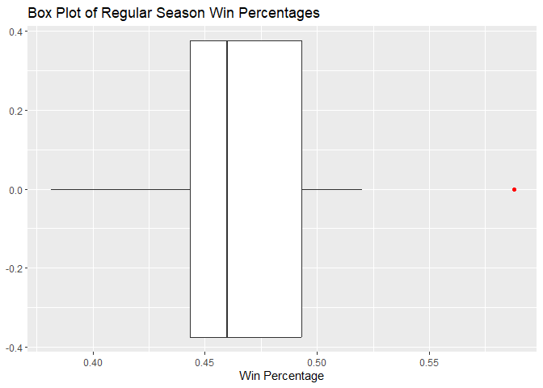
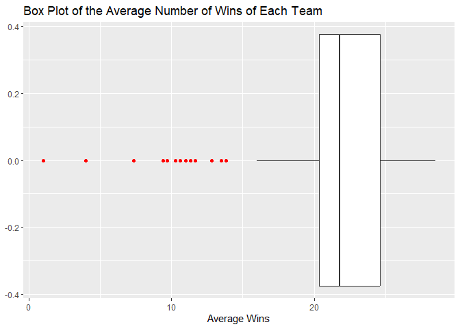
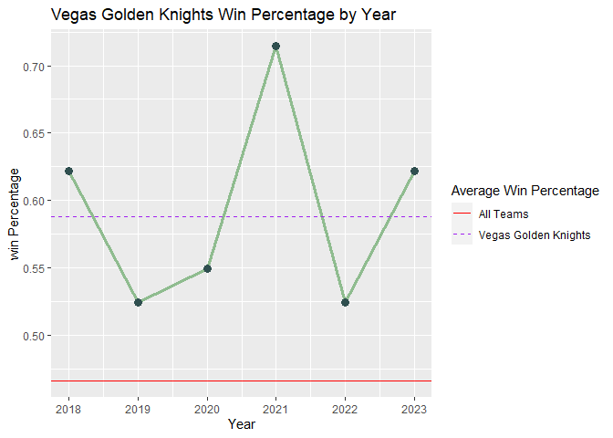
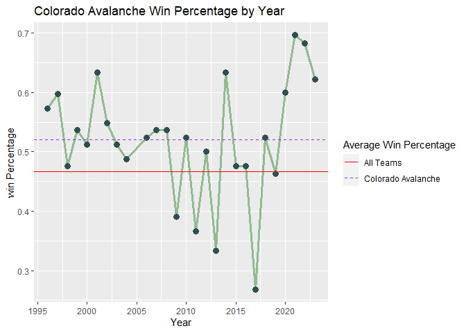
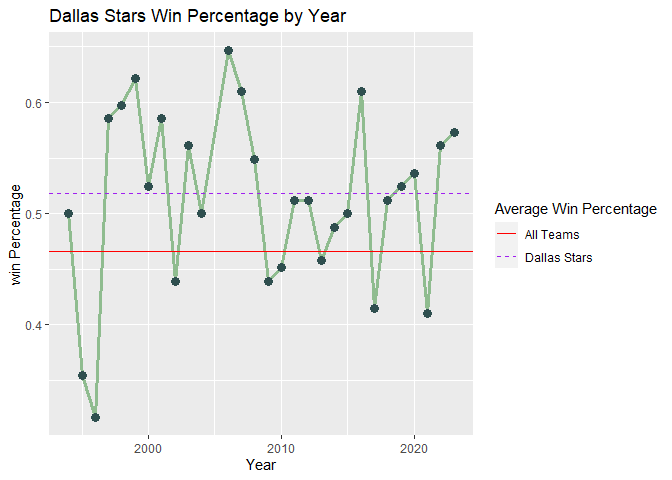
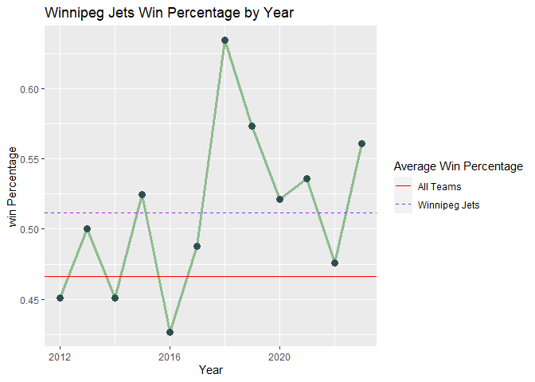
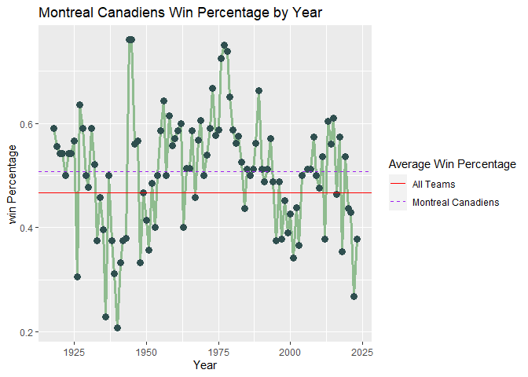
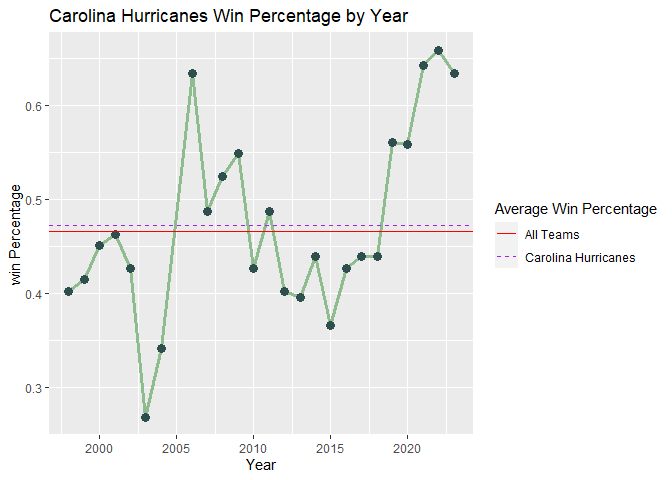
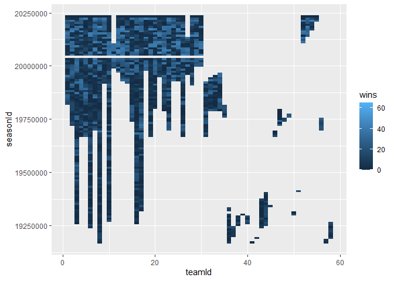

Project-2
================
Jacob Press
2023-10-11

# Project Purpose

I don’t watch hockey but for a while I have thought about getting into
hockey. So I decided to use the data from the NHL API to see if I can
get an idea of what teams are good.

# Intall Packages

Below I am installing all the necessary packages.

``` r
library(jsonlite)
library(tidyverse)
```

# Functions to Quiry API

Here I made a list of the `teamNames` corresponding to their `teamID` to
be used if needed when calling the functions I made.

``` r
outputAPI1 <- fromJSON("https://records.nhl.com/site/api/franchise-season-results")
  list <- outputAPI1$data  
  teamID<- list %>% select(teamId, teamName) %>% arrange(teamId) %>% distinct(teamId, teamName)
  teamID
```

    ##    teamId                teamName
    ## 1       1       New Jersey Devils
    ## 2       2      New York Islanders
    ## 3       3        New York Rangers
    ## 4       4     Philadelphia Flyers
    ## 5       5     Pittsburgh Penguins
    ## 6       6           Boston Bruins
    ## 7       7          Buffalo Sabres
    ## 8       8      Montréal Canadiens
    ## 9       9         Ottawa Senators
    ## 10     10     Toronto Maple Leafs
    ## 11     11       Atlanta Thrashers
    ## 12     12     Carolina Hurricanes
    ## 13     13        Florida Panthers
    ## 14     14     Tampa Bay Lightning
    ## 15     15     Washington Capitals
    ## 16     16      Chicago Blackhawks
    ## 17     17       Detroit Red Wings
    ## 18     18     Nashville Predators
    ## 19     19         St. Louis Blues
    ## 20     20          Calgary Flames
    ## 21     21      Colorado Avalanche
    ## 22     22         Edmonton Oilers
    ## 23     23       Vancouver Canucks
    ## 24     24           Anaheim Ducks
    ## 25     25            Dallas Stars
    ## 26     26       Los Angeles Kings
    ## 27     27         Phoenix Coyotes
    ## 28     28         San Jose Sharks
    ## 29     29   Columbus Blue Jackets
    ## 30     30          Minnesota Wild
    ## 31     31   Minnesota North Stars
    ## 32     32        Quebec Nordiques
    ## 33     33    Winnipeg Jets (1979)
    ## 34     34        Hartford Whalers
    ## 35     35        Colorado Rockies
    ## 36     36  Ottawa Senators (1917)
    ## 37     37         Hamilton Tigers
    ## 38     38      Pittsburgh Pirates
    ## 39     39    Philadelphia Quakers
    ## 40     40         Detroit Cougars
    ## 41     41      Montreal Wanderers
    ## 42     42         Quebec Bulldogs
    ## 43     43        Montreal Maroons
    ## 44     44      New York Americans
    ## 45     45        St. Louis Eagles
    ## 46     46           Oakland Seals
    ## 47     47          Atlanta Flames
    ## 48     48      Kansas City Scouts
    ## 49     49        Cleveland Barons
    ## 50     50         Detroit Falcons
    ## 51     51      Brooklyn Americans
    ## 52     52           Winnipeg Jets
    ## 53     53         Arizona Coyotes
    ## 54     54    Vegas Golden Knights
    ## 55     55          Seattle Kraken
    ## 56     56 California Golden Seals
    ## 57     57          Toronto Arenas
    ## 58     58    Toronto St. Patricks

Below is are some functions I made to query the NHL API. The above table
serves as a key for the team names and corresponding `teamID`. There are
2 additional filters the user can add for whether the games are regular
season, playoff games and if the team is an active hockey team or not.

- game = 2 for regular season game  
- game = 3 for playoff game  
- active = TRUE for active teams  
- active = FALSE for non active teams

The functions I wrote are:

1.  `allTeamTotals` with the filters `active` and `game` will return all
    the stats for each active or inactive team for their regular season
    or playoff games.
2.  `teamWLTotals` with the filter `team` and `games` will return the
    win/loss data for a team which is input by the user for their
    regular or playoff season.
3.  `wlTotalBySeason` will return all the totals for each team for each
    season.  
4.  `teamWLTotalBySeason` will return the win/loss information for a
    given team for either the regular season or the playoffs.

``` r
# team totals for active NHL teams for either regular or playoff games.
allTeamTotals <- function(active = TRUE, game = 2){
  baseURL <- "https://records.nhl.com/site/api/"
  filterURL <- "franchise-team-totals?cayenneExp=activeTeam="
  filterURL2 <- "%20and%20gameTypeId="
  fullURL <- paste0(baseURL, filterURL, active, filterURL2, game)
  output <- fromJSON(fullURL)
  return(output$data)
}
# win loss totals for a given team for either regular or playoff games
teamWLTotals <- function(team = 12, game = 2){
  baseURL <- "https://records.nhl.com/site/api/"
  filterURL1 <- "franchise-team-totals?cayenneExp=teamId="
  fitlerURL2 <- "%20and%20gameTypeId="
  fullURL <- paste0(baseURL, filterURL1, team, fitlerURL2, game)
  outputAPI <- fromJSON(fullURL)
    output <- outputAPI$data %>% select(teamName, contains("wins"), homeLosses, roadLosses, losses, gamesPlayed, gameWinPctg)
    return(output)
}
# win loss totals by season
wlTotalBySeason <- function(){
  outputAPI <- fromJSON("https://records.nhl.com/site/api/franchise-season-results")
    output <- outputAPI$data %>% arrange(teamId) 
    return(output)
}  
# win loss totals by season for a given team for regular or playoff games.
teamWLTotalBySeason <- function(team = 12, game = 2){
  baseURL <- "https://records.nhl.com/site/api/"
  filterURL1 <- "franchise-season-results?cayenneExp=teamId="
  fitlerURL2 <- "%20and%20gameTypeId="
  fullURL <- paste0(baseURL, filterURL1, team, fitlerURL2, game)
  outputAPI <- fromJSON(fullURL)
    output <- outputAPI$data %>% arrange(seasonId) %>% filter(seasonId != 20232024) %>%
      mutate(year = as.numeric(substr(seasonId, 5,8))) %>%
      select(teamName, seasonId, year, contains("wins"), homeLosses, roadLosses, losses, gamesPlayed)
    return(output)
}
```

# Exploratory Data Analysis

I am interested in finding the best active NHL team so I produced a
contingency table of the active teams and the number of cups they have
won.

``` r
# contingency table for the number of cups each active NHL team has.
allteamTotals <- allTeamTotals(active = TRUE, game = 2) %>% mutate(avgWinPct = mean(gameWinPctg))
  table(allteamTotals$teamName, allteamTotals$cups)
```

    ##                        
    ##                         0 1 2 3 4 5 6 11 23
    ##   Anaheim Ducks         0 1 0 0 0 0 0  0  0
    ##   Arizona Coyotes       1 0 0 0 0 0 0  0  0
    ##   Boston Bruins         0 0 0 0 0 0 1  0  0
    ##   Buffalo Sabres        1 0 0 0 0 0 0  0  0
    ##   Calgary Flames        0 1 0 0 0 0 0  0  0
    ##   Carolina Hurricanes   0 1 0 0 0 0 0  0  0
    ##   Chicago Blackhawks    0 0 0 0 0 0 1  0  0
    ##   Colorado Avalanche    0 0 0 1 0 0 0  0  0
    ##   Columbus Blue Jackets 1 0 0 0 0 0 0  0  0
    ##   Dallas Stars          0 1 0 0 0 0 0  0  0
    ##   Detroit Red Wings     0 0 0 0 0 0 0  1  0
    ##   Edmonton Oilers       0 0 0 0 0 1 0  0  0
    ##   Florida Panthers      1 0 0 0 0 0 0  0  0
    ##   Los Angeles Kings     0 0 1 0 0 0 0  0  0
    ##   Minnesota Wild        1 0 0 0 0 0 0  0  0
    ##   Montréal Canadiens    0 0 0 0 0 0 0  0  1
    ##   Nashville Predators   1 0 0 0 0 0 0  0  0
    ##   New Jersey Devils     0 0 0 1 0 0 0  0  0
    ##   New York Islanders    0 0 0 0 1 0 0  0  0
    ##   New York Rangers      0 0 0 0 1 0 0  0  0
    ##   Ottawa Senators       1 0 0 0 0 0 0  0  0
    ##   Philadelphia Flyers   0 0 1 0 0 0 0  0  0
    ##   Pittsburgh Penguins   0 0 0 0 0 1 0  0  0
    ##   San Jose Sharks       1 0 0 0 0 0 0  0  0
    ##   Seattle Kraken        1 0 0 0 0 0 0  0  0
    ##   St. Louis Blues       0 1 0 0 0 0 0  0  0
    ##   Tampa Bay Lightning   0 0 0 1 0 0 0  0  0
    ##   Toronto Maple Leafs   0 0 0 0 0 0 0  1  0
    ##   Vancouver Canucks     1 0 0 0 0 0 0  0  0
    ##   Vegas Golden Knights  0 1 0 0 0 0 0  0  0
    ##   Washington Capitals   0 1 0 0 0 0 0  0  0
    ##   Winnipeg Jets         1 0 0 0 0 0 0  0  0

Here I made a list of the top 5 teams with the highest win percentages
in the regular season.  
Note: I decided to only look at the regular season because I think the
playoff season’s win percentage would be skewed due to it being a
tournament.

``` r
# teams win the 5 highest regular season win percentages
topWinPercent <- allTeamTotals(active = TRUE, game = 2) %>%
  arrange(desc(gameWinPctg)) %>% distinct(teamName, .keep_all = TRUE) %>% select(teamName, teamId, gameWinPctg, cups)
  head(topWinPercent,5)
```

    ##               teamName teamId gameWinPctg cups
    ## 1 Vegas Golden Knights     54      0.5877    1
    ## 2   Colorado Avalanche     21      0.5201    3
    ## 3         Dallas Stars     25      0.5178    1
    ## 4        Winnipeg Jets     52      0.5115    0
    ## 5   Montréal Canadiens      8      0.5073   23

Here I made data frames of the top 5 teams by win percentage, I decided
to include the Carolina Hurricanes since I am from NC I wanted to see
how the Hurricanes stack up to top teams by win percentage.

The data frames include the `seasonID`, `year`, `homeWins`, `wins`,
`homeLosses`, `roadLosses,` `Losses`, `gamesPlayed`, `meanWins`, and
`overallWinPctg` variables.

``` r
VegasGoldenKnights <- teamWLTotalBySeason(54,2) %>% 
  mutate(meanWins = mean(wins, na.rm = TRUE), winPctg = wins/gamesPlayed, overallWinPctg = teamWLTotals(54,2)$gameWinPctg)

coloradoAvalanche <- teamWLTotalBySeason(21,2) %>% 
  mutate(meanWins = mean(wins, na.rm = TRUE), winPctg = wins/gamesPlayed, overallWinPctg = teamWLTotals(21,2)$gameWinPctg)

dallasStars <- teamWLTotalBySeason(25,2) %>% 
  mutate(meanWins = mean(wins, na.rm = TRUE), winPctg = wins/gamesPlayed, overallWinPctg = teamWLTotals(25,2)$gameWinPctg)

winnipegJets <- teamWLTotalBySeason(52,2) %>% 
  mutate(meanWins = mean(wins, na.rm = TRUE), winPctg = wins/gamesPlayed, overallWinPctg = teamWLTotals(52,2)$gameWinPctg)

montrealCanadiens <- teamWLTotalBySeason(8,2) %>% 
  mutate(meanWins = mean(wins, na.rm = TRUE), winPctg = wins/gamesPlayed, overallWinPctg = teamWLTotals(8,2)$gameWinPctg)

carolinaHurricanes <- teamWLTotalBySeason(12,2) %>% 
  mutate(meanWins = mean(wins, na.rm = TRUE), winPctg = wins/gamesPlayed, overallWinPctg = teamWLTotals(12,2)$gameWinPctg)
```

# Graphs

Here is a box plot showing the spread of the win percentages for the
regular seasons for all the teams.

``` r
g <- ggplot(data = allteamTotals, aes(x= gameWinPctg))
g + geom_boxplot(outlier.colour = "red") + labs(x = "Win Percentage", title = "Box Plot of Regular Season Win Percentages")
```

<!-- -->

Here is a box plot to show the spread of the average number of wins for
each team.

``` r
wByTeam <- wlTotalBySeason() %>% select(teamName, seasonId, wins) %>% 
  group_by(teamName) %>% mutate(avgWins = mean(wins))

g <- ggplot(data = wByTeam, aes(x= avgWins))
g + geom_boxplot(outlier.colour = "red") + labs(x = "Average Wins", title = "Box Plot of the Average Number of Wins of Each Team")
```

<!-- -->

Below are line graphs of the win percentages for the top 5 teams and the
Carolina Hurricanes by the years.

``` r
g <- ggplot(data = VegasGoldenKnights, aes(x = year, y = winPctg))
g + geom_line(color = "darkseagreen", size = 1.2) + geom_point(color = "darkslategrey", size = 3) + 
  labs(x = "Year", y = "win Percentage", title = "Vegas Golden Knights Win Percentage by Year") + 
    geom_hline(aes(yintercept = overallWinPctg, linetype = "Vegas Golden Knights"), color = "purple") + 
      geom_hline(aes(yintercept = allteamTotals$avgWinPct[1], linetype = "All Teams"), color = "red") +
        scale_linetype_manual(name = "Average Win Percentage", values = c(1,2), guide = guide_legend(override.aes = list(color = c("red", "purple"))))
```

<!-- -->

``` r
g <- ggplot(data = coloradoAvalanche, aes(x = year, y = winPctg))
g + geom_line(color = "darkseagreen", size = 1.2) + geom_point(color = "darkslategrey", size = 3) + 
  labs(x = "Year", y = "win Percentage", title = "Colorado Avalanche Win Percentage by Year") + 
    geom_hline(aes(yintercept = overallWinPctg, linetype = "Colorado Avalanche"), color = "purple") + 
      geom_hline(aes(yintercept = allteamTotals$avgWinPct[1], linetype = "All Teams"), color = "red") +
        scale_linetype_manual(name = "Average Win Percentage", values = c(1,2), guide = guide_legend(override.aes = list(color = c("red", "purple"))))
```

<!-- -->

``` r
g <- ggplot(data = dallasStars, aes(x = year, y = winPctg))
g + geom_line(color = "darkseagreen", size = 1.2) + geom_point(color = "darkslategrey", size = 3) + 
  labs(x = "Year", y = "win Percentage", title = "Dallas Stars Win Percentage by Year") + 
    geom_hline(aes(yintercept = overallWinPctg, linetype = "Dallas Stars"), color = "purple") + 
      geom_hline(aes(yintercept = allteamTotals$avgWinPct[1], linetype = "All Teams"), color = "red") +
        scale_linetype_manual(name = "Average Win Percentage", values = c(1,2), guide = guide_legend(override.aes = list(color = c("red", "purple"))))
```

<!-- -->

``` r
g <- ggplot(data = winnipegJets, aes(x = year, y = winPctg))
g + geom_line(color = "darkseagreen", size = 1.2) + geom_point(color = "darkslategrey", size = 3) + 
  labs(x = "Year", y = "win Percentage", title = "Winnipeg Jets Win Percentage by Year") + 
    geom_hline(aes(yintercept = overallWinPctg, linetype = "Winnipeg Jets"), color = "purple") + 
      geom_hline(aes(yintercept = allteamTotals$avgWinPct[1], linetype = "All Teams"), color = "red") +
        scale_linetype_manual(name = "Average Win Percentage", values = c(1,2), guide = guide_legend(override.aes = list(color = c("red", "purple"))))
```

<!-- -->

``` r
g <- ggplot(data = montrealCanadiens, aes(x = year, y = winPctg))
g + geom_line(color = "darkseagreen", size = 1.2) + geom_point(color = "darkslategrey", size = 3) + 
  labs(x = "Year", y = "win Percentage", title = "Montreal Canadiens Win Percentage by Year") + 
  geom_hline(aes(yintercept = overallWinPctg, linetype = "Montreal Canadiens"), color = "purple") + 
  geom_hline(aes(yintercept = allteamTotals$avgWinPct[1], linetype = "All Teams"), color = "red") +
  scale_linetype_manual(name = "Average Win Percentage", values = c(1,2), guide = guide_legend(override.aes = list(color = c("red", "purple"))))
```

<!-- -->

``` r
g <- ggplot(data = carolinaHurricanes, aes(x = year, y = winPctg))
g + geom_line(color = "darkseagreen", size = 1.2) + geom_point(color = "darkslategrey", size = 3) + 
  labs(x = "Year", y = "win Percentage", title = "Carolina Hurricanes Win Percentage by Year") + 
  geom_hline(aes(yintercept = overallWinPctg, linetype = "Carolina Hurricanes"), color = "purple") + 
  geom_hline(aes(yintercept = allteamTotals$avgWinPct[1], linetype = "All Teams"), color = "red") +
  scale_linetype_manual(name = "Average Win Percentage", values = c(1,2), guide = guide_legend(override.aes = list(color = c("red", "purple"))))
```

<!-- -->

From these line graphs and the contingency table,of the teams and the
cups they have won, we can determine the Montreal Canadians seem to be
one of the best teams in history as they consistently have an above
overage win percentage, their win percentage is in the top 5 of all
active teams, they are the oldest team in the top 5, and they have the
most cup wins. But, we can also determine the Carolina Hurricanes seem
to be a decent team because they have an above average win percentage,
they have won a cup, and they seem to have been improving since 2016.

# Heat Map

Here I included a heat map of the wins by year and teamId.I know this
graph is not very useful but we had to include a graph we didn’t use
during class, and currently I am out of ideas.

``` r
data <- wlTotalBySeason()
g <- ggplot(data = data, aes(x= teamId, y = seasonId, fill = wins))
  g + geom_tile()
```

<!-- -->

# Take Aways

The main take away from this project is the Montreal Canadians seem to
be a pretty impressive franchise as they have a top 5 win percentage
over the years and the most cups wins. But the Hurricanes seem to be a
decent team so if I decide to start watching hockey I reckon I will pull
for them since I’m from NC.

<!-- rmarkdown::render(input = "Project-2.Rmd", output_format = "github_document", output_file = "README.md") -->
